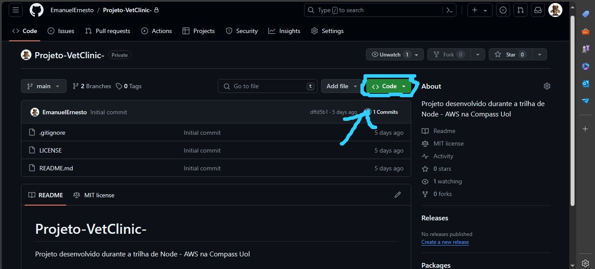
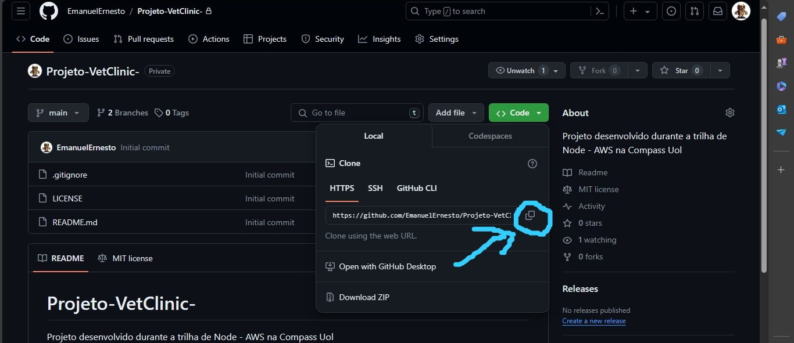

<h1 align =center>Projeto VetClinic 🐶🐱 </h1>

O projeto descrito a seguir se trata de uma API que armazena dados de tutores e pets, onde um pet pode ter apenas um tutor, mas o mesmo tutor pode ter vários pets.


<h2>🤔 Requisitos para rodar o projeto na máquina</h2>

Para rodar o projeto na sua máquina, é crucial possuir tanto o <strong>npm</strong> quanto o <strong>node</strong> instalados. Para um tutorial de como instalá-los você pode ir para o site abaixo para verificar como baixa-los em sua máquina, independente do sistema operacional (Windows, linux, Mac)

<a href = "https://www.alura.com.br/artigos/como-instalar-node-js-windows-linux-macos?utm_term=&utm_campaign=%5BSearch%5D+%5BPerformance%5D+-+Dynamic+Search+Ads+-+Artigos+e+Conte%C3%BAdos&utm_source=adwords&utm_medium=ppc&hsa_acc=7964138385&hsa_cam=11384329873&hsa_grp=111087461203&hsa_ad=687448474447&hsa_src=g&hsa_tgt=aud-1295637864136:dsa-2276348409543&hsa_kw=&hsa_mt=&hsa_net=adwords&hsa_ver=3&gad_source=1&gclid=CjwKCAjw0YGyBhByEiwAQmBEWpSYzj8dyfjef_r_mFgDJuSZS3GQeoRcg4VvqtRYV2XW3--XzajnARoCjgkQAvD_BwE">Clique aqui para acessar.</a>

<h2>🔧 Dependências</h2>

As dependências utilizadas no projeto estarão listadas abaixo.

```
"dotenv": "^16.4.5",
"express": "^4.19.2",
"express-validator": "^7.0.1",
"sequelize": "^6.37.3",
"sqlite3": "^5.1.7"
```

<h2>🔌 Como baixar o projeto e rodar ele</h2>

</img> 

Após ter o <strong>npm</strong> e o <strong>node</strong> instalados em sua máquina, você deve clicar no botão verde.

</img> 

Após isso você deve clicar na opção destacada para copiar o link. No prompt de comando (CMD) ou no terminal de sua máquina,  rode o comando:

```
git clone https://github.com/EmanuelErnesto/Projeto-VetClinic-.git

```

Com o projeto na sua máquina, vá até a pasta onde está localizada o projeto recém baixado e rode o comando:

```
cd Projeto-VetClinic-
```

Logo a seguir, para entrar no visual studio code rode o comando:

```
code .
```

Dentro do VSCode, você deve abrir o terminal e rodar o comando: 

```
npm install
```

Com ele, estará baixando todas as dependências necessárias para o projeto funcionar. No repositório está o arquivo <strong>.env.example</strong>. Nele, estarão listadas as configurações necessárias para a API funcionar corretamente. 

```
PORT = 3000
DATABASE = "vetclinic"
USER = "root"
PASSWORD = "root"
HOST = "localhost"

```

Para usá-las, crie um arquivo chamado .env e o preencha com configurações em um estilo parecido com o acima. Com ele criado, abra o terminal novamente e rode o comando:

```
npm start
```

Com ele, você poderá desfrutar de todas as funcionalidades da API. Seguem a seguir os endpoints e os dados que eles devem retornar/enviar

```
- GET  /tutors -> Lista todos os tutores
- POST /tutor -> Cria um novo tutor
- PUT  /tutor/:id -> Atualiza um tutor existente
- DELETE  /tutor/:id -> Deleta um tutor
- POST  /pet/:tutorId-> Cria um pet e adiciona um tutor a ele
- PUT  /pet/:petId/tutor/:tutorId -> Atualiza a informação de um pet
- DELETE  /pet/:petId/tutor/:tutorId -> Deleta um pet de um tutor

```

Só um aviso! Lembre-se de colocar o /api na url. Segue um exemplo de como deve ficar a url de requisição

```
http://localhost:3000/api/tutors

```

Tendo tudo isso em mente, agora você poderá desfrutar de todas as funcionalidades do projeto. Divirta-se! 🚀

<h2>🔎 Feedbacks</h2>

Tem alguma funcionalidade a sugerir ou uma sugestão de como posso melhorar o código? Entre em contato comigo pelo linkedin ou abra uma PR para discutirmos melhor isso 

<a href= "https://www.linkedin.com/in/emanuel-ernesto-6b5a5726b/?originalSubdomain=br" target="_blank" >Linkedin</a>
